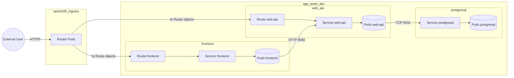

# Developer Guide — OpenShift deny-by-default: the simple version

## 1) Topology (baseline)

This is the baseline for everything in this guide.




**Namespace:** `app-team-dev`

**Workloads:**

- `frontend` (Route + Service + Deployment) listens on `8080`
- `web-api` (Route + Service + Deployment) listens on `8080`
- `postgresql` (Service + StatefulSet) listens on `5432`

**Allowed traffic (the only flows we are allowing):**

- Internet → router (`openshift-ingress`) → Route → Service → `frontend` pods (`8080`)
- Internet → router (`openshift-ingress`) → Route → Service → `web-api` pods (`8080`)
- `frontend` pods → Service `web-api` → `web-api` pods (`8080`)
- `web-api` pods → Service `postgresql` → `postgresql` pods (`5432`)
- (optional) `web-api` pods → External API (`443`)

One critical rule:

- A **Service** is just forwarding. It does not “accept” or “deny”.
- NetworkPolicy is enforced on **pods**.

---

This guide is for app developers. It answers 2 things:

1) Which NetworkPolicies you need, where they apply, and why
2) How to render Helm and run the policy checks locally

Quick links:

- CD reference: [CD.md](CD.md)
- Helm library contract: [cd/shared-lib/ag-helm/docs/SIMPLE-API.md](../cd/shared-lib/ag-helm/docs/SIMPLE-API.md)
- Helm library examples: [cd/shared-lib/ag-helm/docs/EXAMPLES.md](../cd/shared-lib/ag-helm/docs/EXAMPLES.md)

---

## 2) What “deny-by-default” actually means (in plain terms)

- Kubernetes does not deny all traffic by default.
- Pods become default-deny only when they are selected by NetworkPolicy for that direction.
- In a “deny-by-default” platform, you typically have a namespace baseline policy selecting all pods.

If your namespace already has a baseline `default-deny` (Ingress+Egress):

- Every connection must be explicitly allowed by your workload policies.

If your namespace does NOT have baseline `default-deny`:

- Only pods selected by your policies are restricted.

---

## 3) The policy table (what policy, where, why)

You need **3 workload policies** (one per workload). You may also have **1 optional namespace default-deny**.

### 3.1 Inventory

| Policy | Selects pods | Why it exists | Main allow rules |
|---|---|---|---|
| `default-deny` (optional) | all pods | baseline “nothing talks unless allowed” | none (Ingress+Egress denied) |
| `frontend` | `frontend` pods | allow router ingress and frontend → api calls | Ingress from router to `8080`; Egress to `web-api:8080` |
| `web-api` | `web-api` pods | allow router ingress, frontend → api, and api → db + optional external | Ingress from router + frontend to `8080`; Egress to `postgresql:5432` (+ optional `443`) |
| `postgresql` | `postgresql` pods | allow api → db | Ingress from `web-api` to `5432` |

### 3.2 “How does X talk to Y?” table

| Connection | Must be allowed on destination pods (Ingress) | Must be allowed on source pods (Egress) |
|---|---|---|
| router → `frontend:8080` | `frontend` policy | only if router egress is restricted (usually platform-managed) |
| router → `web-api:8080` | `web-api` policy | only if router egress is restricted (usually platform-managed) |
| `frontend` → `web-api:8080` | `web-api` policy | `frontend` policy (if your baseline denies egress) |
| `web-api` → `postgresql:5432` | `postgresql` policy | `web-api` policy (if your baseline denies egress) |
| `web-api` → external `:443` | n/a | `web-api` policy |

---

## 4) Copy/paste: the policies you deploy

These snippets use the Helm library intent API.

### 4.1 Optional namespace baseline default-deny

Only deploy this if your platform expects you to provide baseline default-deny yourself.

```yaml
apiVersion: networking.k8s.io/v1
kind: NetworkPolicy
metadata:
  name: default-deny
spec:
  podSelector: {}
  policyTypes:
    - Ingress
    - Egress
```

### 4.2 `frontend` NetworkPolicy

Allows:

- router → `frontend:8080`
- `frontend` → `web-api:8080`

```tpl
{{- $np := dict "Values" .Values -}}
{{- $_ := set $np "ApplicationGroup" .Values.project -}}
{{- $_ := set $np "Name" "frontend" -}}
{{- $_ := set $np "Namespace" $.Release.Namespace -}}

{{- $_ := set $np "PolicyTypes" (list "Ingress" "Egress") -}}

{{- $_ := set $np "AllowIngressFrom" (dict
  "ports" (list 8080)
  "namespaces" (list (dict
    "name" "openshift-ingress"
    "podSelector" (dict "matchLabels" (dict
      "ingresscontroller.operator.openshift.io/deployment-ingresscontroller" "default"
    ))
  ))
) -}}

{{- $_ := set $np "AllowEgressTo" (dict
  "apps" (list (dict
    "name" "web-api"
    "ports" (list (dict "port" 8080 "protocol" "TCP"))
  ))
) -}}

{{ include "ag-template.networkpolicy" $np }}
```

### 4.3 `web-api` NetworkPolicy

Allows:

- router → `web-api:8080`
- `frontend` → `web-api:8080`
- `web-api` → `postgresql:5432`
- (optional) `web-api` → external CIDR(s) on `443`

```tpl
{{- $np := dict "Values" .Values -}}
{{- $_ := set $np "ApplicationGroup" .Values.project -}}
{{- $_ := set $np "Name" "web-api" -}}
{{- $_ := set $np "Namespace" $.Release.Namespace -}}

{{- $_ := set $np "PolicyTypes" (list "Ingress" "Egress") -}}

{{- $_ := set $np "AllowIngressFrom" (dict
  "ports" (list 8080)
  "apps" (list (dict "name" "frontend"))
  "namespaces" (list (dict
    "name" "openshift-ingress"
    "podSelector" (dict "matchLabels" (dict
      "ingresscontroller.operator.openshift.io/deployment-ingresscontroller" "default"
    ))
  ))
) -}}

{{- $_ := set $np "AllowEgressTo" (dict
  "apps" (list (dict
    "name" "postgresql"
    "ports" (list (dict "port" 5432 "protocol" "TCP"))
  ))
  "ipBlocks" (list (dict
    "cidr" "203.0.113.0/24"
    "ports" (list 443)
  ))
) -}}

{{ include "ag-template.networkpolicy" $np }}
```

Notes:

- `203.0.113.0/24` is a documentation-only CIDR. Replace it with your real external API CIDR(s).
- If you truly need `0.0.0.0/0`, your policy checks require approval annotations (see below).

### 4.4 `postgresql` NetworkPolicy

Allows:

- `web-api` → `postgresql:5432`

```tpl
{{- $np := dict "Values" .Values -}}
{{- $_ := set $np "ApplicationGroup" .Values.project -}}
{{- $_ := set $np "Name" "postgresql" -}}
{{- $_ := set $np "Namespace" $.Release.Namespace -}}

{{- $_ := set $np "PolicyTypes" (list "Ingress") -}}

{{- $_ := set $np "AllowIngressFrom" (dict
  "ports" (list 5432)
  "apps" (list (dict "name" "web-api"))
) -}}

{{ include "ag-template.networkpolicy" $np }}
```

### 4.5 Internet-wide egress approvals (only when you really need it)

If you allow internet-wide egress (`0.0.0.0/0` or `::/0`), Conftest requires:

```yaml
metadata:
  annotations:
    justification: "Why this service needs internet-wide egress"
    approvedBy: "Ticket/approver"
```

---

## 5) Render Helm and run the checks (the only local workflow you need)

### 5.1 Consume the Helm library via OCI

In your app chart’s `Chart.yaml`:

```yaml
dependencies:
  - name: ag-helm-templates
    version: "<released-version>"
    repository: "oci://ghcr.io/bcgov-c/helm"
```

If the registry requires auth:

```powershell
echo $env:GITHUB_TOKEN | helm registry login ghcr.io -u <github-user> --password-stdin
```

Then:

```powershell
helm dependency update .\path\to\your-chart
```

### 5.2 Render

```powershell
helm template myapp .\path\to\your-chart --values .\values.yaml --debug > rendered.yaml
```

### 5.3 Run policy tools on the rendered YAML

```powershell
datree test rendered.yaml --policy-config cd/policies/datree-policies.yaml
polaris audit --config cd/policies/polaris.yaml --format pretty rendered.yaml
kube-linter lint rendered.yaml --config cd/policies/kube-linter.yaml
conftest test rendered.yaml --policy cd/policies --all-namespaces --fail-on-warn
```

---

## 6) Common failures (quick fixes)

| Symptom | Usually means | Fix |
|---|---|---|
| Route exists, but 503/timeout | router can’t reach pods | allow router → pods on the right port in the workload policy |
| frontend can’t call web-api | api pods don’t allow ingress from frontend (or frontend egress blocked) | allow `frontend` → `web-api:8080` (Ingress on api; and Egress on frontend if egress is restricted) |
| api can’t reach db | db pods don’t allow ingress from api (or api egress blocked) | allow `web-api` → `postgresql:5432` (Ingress on db; and Egress on api if egress is restricted) |
| Conftest denies NetworkPolicy | allow-all shape detected | ensure every ingress has `from` + `ports`, every egress has `to` + `ports` |


