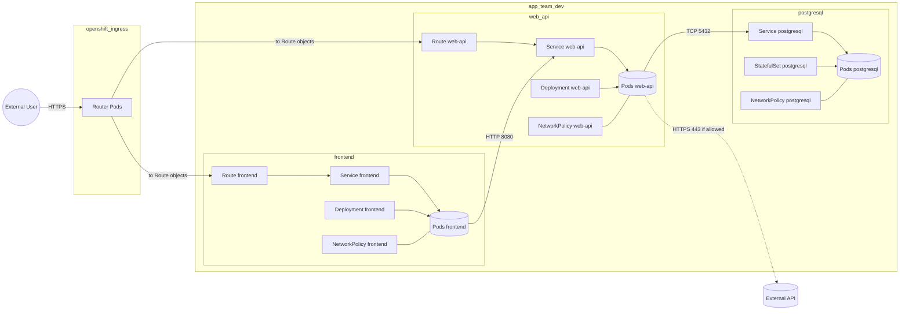

# Developer Guide — Deploying to a deny-by-default OpenShift cluster


This guide is for **application developers** deploying into a **deny-by-default** OpenShift/Kubernetes environment.
It shows a single “real app” topology, then walks through the minimum steps to render Helm, run policy checks, and author NetworkPolicy that matches how traffic actually flows.

Quick links:

- CD reference (Helm library + policy requirements): [CD.md](CD.md)
- Helm library contract: [cd/shared-lib/ag-helm/docs/SIMPLE-API.md](../cd/shared-lib/ag-helm/docs/SIMPLE-API.md)
- Helm library examples: [cd/shared-lib/ag-helm/docs/EXAMPLES.md](../cd/shared-lib/ag-helm/docs/EXAMPLES.md)

---

## Example used throughout this guide (the “real app” scenario)

**Namespace:** `app-team-dev`

**Workloads (all in the same namespace):**

- `frontend` (Deployment + Service + Route)
  - Exposed externally via OpenShift Route
  - Calls `web-api` over HTTP `:8080`
- `web-api` (Deployment + Service + Route)
  - Exposed externally via OpenShift Route
  - Accepts requests in two ways:
    - External: `Route web-api` → `Service web-api` → `web-api` pods on `:8080`
    - Internal: `frontend` pods call the in-cluster DNS name `http://web-api:8080` (Service) → `web-api` pods
  - In deny-by-default setups, this only works if `web-api` NetworkPolicy allows ingress to port `8080` from:
    - the router pods (namespace `openshift-ingress`) and
    - the `frontend` pods (same namespace)
  - Calls `postgresql` over TCP `:5432` by connecting to the Service name `postgresql:5432` (Service) → which forwards to `postgresql` pods
    - In deny-by-default setups, the DB only responds if `postgresql` NetworkPolicy allows **ingress** from `web-api` on `5432`
    - If `web-api` egress is restricted, `web-api` NetworkPolicy must also allow **egress** to `postgresql` on `5432`
  - Optionally calls an external API over HTTPS `:443`
- `postgresql` (StatefulSet + Service)
  - Internal only (no Route)

**What the topology is trying to capture**

- External traffic enters via OpenShift router pods in the `openshift-ingress` namespace.
- In your namespace, traffic is always **Route → Service → Pods** (not Route → Pods).
- A Service does not “allow/deny” traffic — it’s a virtual IP that forwards to pods. NetworkPolicy applies to **pods**, so your selectors/ports must match what the Service forwards to.
- Because the cluster is deny-by-default, each workload needs explicit allows for exactly what it needs:
  - Router → exposed workloads (ingress)
  - `frontend` → `web-api` (in-namespace)
  - `web-api` → `postgresql` (egress)
  - optional `web-api` → external API (egress; approval required if internet-wide)

### Topology diagram

If this Mermaid diagram does not render in your viewer:

- Mermaid renders in **Markdown Preview** (VS Code: `Ctrl+Shift+V`).
- If your renderer doesn’t support Mermaid, use the rendered image below.




---

## 0) What “deny-by-default” means

- Kubernetes is **not** “deny everything” by default.
- Traffic becomes default-deny **only for pods selected by a NetworkPolicy** (for the direction(s) that policy applies to).
- In a platform described as “deny-by-default”, one of these is usually true:
  - Your namespace has a baseline **default-deny** NetworkPolicy selecting all pods (common pattern), or
  - Your platform/CNI enforces deny-by-default at a higher layer.

What this means for you:

- router → exposed workloads (ingress)
- app → app calls (ingress on the callee; and egress on the caller if egress is restricted)
- app → database calls (same)

### Traffic matrix for the example topology

This is the “why does web-api receive requests from frontend” answer in one place.

| Flow                                                                           | Works when…                                                                                                                                                   | Enforced by                                                                        |
| ------------------------------------------------------------------------------ | -------------------------------------------------------------------------------------------------------------------------------------------------------------- | ---------------------------------------------------------------------------------- |
| External user →`frontend` Route → Service → `frontend` pods (`:8080`) | `frontend` pods allow **ingress** from router pods                                                                                                     | `frontend` NetworkPolicy (ingress)                                               |
| External user →`web-api` Route → Service → `web-api` pods (`:8080`)   | `web-api` pods allow **ingress** from router pods                                                                                                      | `web-api` NetworkPolicy (ingress)                                                |
| `frontend` pods → `web-api` Service (`:8080`)                           | `web-api` pods allow **ingress** from `frontend` pods; plus `frontend` allows **egress** to `web-api` *if* frontend egress is restricted | `web-api` NetworkPolicy (ingress) + optional `frontend` NetworkPolicy (egress) |
| `web-api` pods → `postgresql` Service (`:5432`)                         | `postgresql` pods allow **ingress** from `web-api`; plus `web-api` allows **egress** to `postgresql`                                       | `postgresql` NetworkPolicy (ingress) + `web-api` NetworkPolicy (egress)        |
| `web-api` pods → external API (`:443`)                                    | `web-api` allows **egress** to the destination CIDR(s) on `443` (internet-wide requires approval annotations)                                        | `web-api` NetworkPolicy (egress)                                                 |

---

## 1) Prerequisites (local)

- `helm` installed
- Access to the OCI registry that hosts the Helm library (GHCR)
- Policy tools installed in your dev environment:
  - Datree
  - Polaris
  - kube-linter
  - Conftest

---

## 2) Consume the Helm library via OCI (recommended)

In your app chart’s `Chart.yaml`, add the dependency:

```yaml
dependencies:
  - name: ag-helm-templates
    version: "<released-version>"
    repository: "oci://ghcr.io/bcgov-c/helm"
```

If the registry requires auth:

```powershell
echo $env:GITHUB_TOKEN | helm registry login ghcr.io -u <github-user> --password-stdin
```

Then update dependencies:

```powershell
helm dependency update .\path\to\your-chart
```

---

## 3) Render manifests and run policy checks

Render (produce the single YAML file that all policy tools should check):

```powershell
helm template myapp .\path\to\your-chart --values .\values.yaml --debug > rendered.yaml
```

Run the policy checks:

```powershell
datree test rendered.yaml --policy-config cd/policies/datree-policies.yaml
polaris audit --config cd/policies/polaris.yaml --format pretty rendered.yaml
kube-linter lint rendered.yaml --config cd/policies/kube-linter.yaml
conftest test rendered.yaml --policy cd/policies --all-namespaces --fail-on-warn
```

---

## 4) Minimum Helm resources you must render

For the example topology above, each workload needs:

- Deployment/StatefulSet
- Service
- Route (only for `frontend` and `web-api`)
- NetworkPolicy

If you expose a service externally, Route/Ingress must include the AVI infra setting annotation:

- `metadata.annotations["aviinfrasetting.ako.vmware.com/name"]`
- allowed values: `dataclass-low|dataclass-medium|dataclass-high|dataclass-public`

---

## 5) NetworkPolicy patterns that match the topology

The repo’s Rego policy (`cd/policies/network-policies.rego`) denies “accidental allow-all” shapes.
Use the Helm library intent API (`AllowIngressFrom` / `AllowEgressTo`) so your rules stay explicit.

### 5.0 NetworkPolicies you must deploy (what exists, and what applies to what)

For the “real app” topology in this guide, you should expect **three per-workload NetworkPolicy objects** — one per workload:

- `frontend` NetworkPolicy
  - Ingress: allow router pods (because `frontend` has a Route)
  - Egress: allow calls to `web-api:8080`
- `web-api` NetworkPolicy
  - Ingress: allow `frontend` + router pods (because `web-api` has a Route)
  - Egress: allow calls to `postgresql:5432` and optional external API `:443`
- `postgresql` NetworkPolicy
  - Ingress: allow `web-api` to connect on `5432`

Depending on your platform, you may also have (or choose to add) **one namespace-level default-deny policy**:

- `default-deny` NetworkPolicy (selects all pods; no allow rules)
  - Ingress: denied unless another policy allows it
  - Egress: denied unless another policy allows it

Optional (only if your platform requires you to deploy default-deny yourself):

```yaml
apiVersion: networking.k8s.io/v1
kind: NetworkPolicy
metadata:
  name: default-deny
spec:
  podSelector: {}
  policyTypes:
    - Ingress
    - Egress
```

How many policies “in API” (web-api)?

- **Exactly 1** policy should select the `web-api` pods: the `web-api` NetworkPolicy.
- The `frontend` and `postgresql` NetworkPolicies do **not** apply to `web-api` pods (they select different labels).
- If a namespace-level `default-deny` exists, it applies to **all** pods including `web-api`.

Important: for `web-api → postgresql` traffic to work, you typically need **both**:

- Egress allowed from `web-api`
- Ingress allowed to `postgresql`

### 5.1 frontend policy (matches the diagram)

What this policy allows:

- Ingress to `frontend` on `8080` from router pods in `openshift-ingress` (because `frontend` has a Route)
- Egress from `frontend` to `web-api` on `8080`

```tpl
{{- $np := dict "Values" .Values -}}
{{- $_ := set $np "ApplicationGroup" .Values.project -}}
{{- $_ := set $np "Name" "frontend" -}}
{{- $_ := set $np "Namespace" $.Release.Namespace -}}

{{- $_ := set $np "PolicyTypes" (list "Ingress" "Egress") -}}

{{- $_ := set $np "AllowIngressFrom" (dict
  "ports" (list 8080)
  "namespaces" (list (dict
    "name" "openshift-ingress"
    "podSelector" (dict "matchLabels" (dict
      "ingresscontroller.operator.openshift.io/deployment-ingresscontroller" "default"
    ))
  ))
) -}}

{{- $_ := set $np "AllowEgressTo" (dict
  "apps" (list (dict
    "name" "web-api"
    "ports" (list (dict "port" 8080 "protocol" "TCP"))
  ))
) -}}

{{ include "ag-template.networkpolicy" $np }}
```

### 5.2 web-api policy (matches the diagram)

What this policy allows:

- Ingress to `web-api` on `8080` from:
  - `frontend` pods (same namespace)
  - router pods in `openshift-ingress` (because `web-api` has a Route)
- Egress from `web-api` to:
  - `postgresql` on `5432`
  - a specific external CIDR on `443` (replace with your real destination)

```tpl
{{- $np := dict "Values" .Values -}}
{{- $_ := set $np "ApplicationGroup" .Values.project -}}
{{- $_ := set $np "Name" "web-api" -}}
{{- $_ := set $np "Namespace" $.Release.Namespace -}}

{{- $_ := set $np "PolicyTypes" (list "Ingress" "Egress") -}}

{{- $_ := set $np "AllowIngressFrom" (dict
  "ports" (list 8080)
  "apps" (list (dict "name" "frontend"))
  "namespaces" (list (dict
    "name" "openshift-ingress"
    "podSelector" (dict "matchLabels" (dict
      "ingresscontroller.operator.openshift.io/deployment-ingresscontroller" "default"
    ))
  ))
) -}}

{{- $_ := set $np "AllowEgressTo" (dict
  "apps" (list (dict
    "name" "postgresql"
    "ports" (list (dict "port" 5432 "protocol" "TCP"))
  ))
  "ipBlocks" (list (dict
    "cidr" "203.0.113.0/24"
    "ports" (list 443)
  ))
) -}}

{{ include "ag-template.networkpolicy" $np }}
```

Notes:

- `203.0.113.0/24` is a documentation-only CIDR (TEST-NET-3). Replace it with your real external API range.
- Router label selectors vary by cluster; use [cd/shared-lib/ag-helm/docs/EXAMPLES.md](../cd/shared-lib/ag-helm/docs/EXAMPLES.md) as your baseline and confirm labels in your OpenShift.

### 5.3 postgresql policy (matches the diagram)

What this policy allows:

- Ingress to `postgresql` on `5432` from `web-api` pods

```tpl
{{- $np := dict "Values" .Values -}}
{{- $_ := set $np "ApplicationGroup" .Values.project -}}
{{- $_ := set $np "Name" "postgresql" -}}
{{- $_ := set $np "Namespace" $.Release.Namespace -}}

{{- $_ := set $np "PolicyTypes" (list "Ingress") -}}

{{- $_ := set $np "AllowIngressFrom" (dict
  "ports" (list 5432)
  "apps" (list (dict "name" "web-api"))
) -}}

{{ include "ag-template.networkpolicy" $np }}
```

### 5.4 Internet-wide egress approvals (if you truly need 0.0.0.0/0)

If you allow internet-wide egress, Conftest requires these annotations on the NetworkPolicy:

```yaml
metadata:
  annotations:
    justification: "Why this service needs internet-wide egress"
    approvedBy: "Ticket/approver"
```

---

## 6) Common “it doesn’t work” checks

### Symptom: Route exists but traffic can’t reach the pod

- Route targets the correct Service name/port
- Service selector matches the Deployment pod labels
- NetworkPolicy allows ingress from router pods (router runs in `openshift-ingress`)

### Symptom: Policy tools fail locally

- Run tools against a single `rendered.yaml` that contains all manifests (Deployment + Service + Route + NetworkPolicy)
- Fix allow-all shapes first (missing peers or ports)

---

## 7) Where to go next

- Deep CD reference: [CD.md](CD.md)
- Helm library contract: [cd/shared-lib/ag-helm/docs/SIMPLE-API.md](../cd/shared-lib/ag-helm/docs/SIMPLE-API.md)
- Copy/paste examples: [cd/shared-lib/ag-helm/docs/EXAMPLES.md](../cd/shared-lib/ag-helm/docs/EXAMPLES.md)
